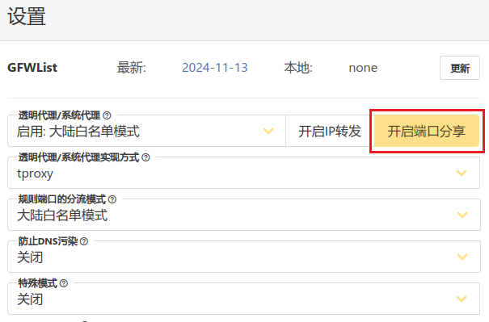
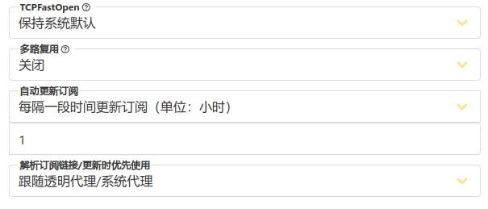

# 可以使用claude版本

> 黄泽赞助

# 无法使用claude版本

> https://manateelazycat.github.io/2023/06/23/best-proxy/

1. 订阅机场: 拷贝订阅 URL, 点击导入按钮导入
2. 选择服务器： 选择 `S.JISUSUB.CC` 标签， 选择一个合适的服务器， 然后选择左上角启动按钮（没有就不用）
3. 更新 GFWList： 点击页面右上角设置按钮， 在设置对话框右上角点击更新按钮更新 GFWLIST， 然后再按照下面的步骤对设置页面进行配置
4. 透明代理/系统代理： `启用: 分流规则与规则端口所选模式一致`
5. 透明代理/系统代理实现方式： `redirect`
6. 规则端口的分流模式： `RoutingA`, 右边的规则配置见下面
7. 防止 DNS 污染： DNS-over-HTTPS
8. 特殊模式： 关闭 （不要选择 supervisor, 这个选项会导致懒猫微服应用打不开）
9. TCPFastOpen: 关闭
10. 多路复用： 关闭
11. 自动更新 GFWList: 每个 1 小时自动更新
12. 自动更新订阅: 每个 1 小时自动更新
13. 解析订阅地址/更新时优先使用： 不进行分流

